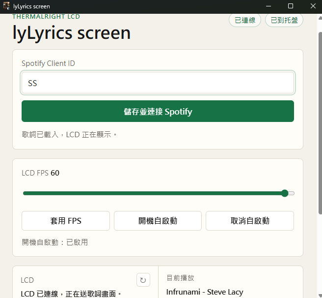

# Spotify Lyrics LCD

把 Spotify 現正播放的歌詞，直接顯示到利民水冷小螢幕 Thermalright USB LCD 上的 Windows app。

## 展示




## 專案連結

- GitHub: [Spotify Lyrics LCD](https://github.com/ChuangHoward902/spotify-lyrics-lcd)
- 變更紀錄: [CHANGELOG.md](CHANGELOG.md)

## 功能

- 直接讀取 Spotify 播放狀態
- 透過 LRCLIB 取得同步歌詞
- 直接把畫面寫進 Thermalright USB LCD
- 內建 Windows 開機自啟動
- 內建最小化到系統匣
- 偵測 `SignalRgb.Service` 是否占用 LCD
- 支援中文歌詞

## 安裝

1. 到 GitHub Release 下載安裝檔： [v0.2.0](https://github.com/ChuangHoward902/spotify-lyrics-lcd/releases/tag/v0.2.0)
2. 執行 `spotify-lyrics-lcd-0.2.0-x64.exe`。
3. 完成安裝後，程式會出現在：

```text
C:\Users\你的使用者名稱\AppData\Local\Programs\spotify-lyrics-lcd
```

4. 首次執行後，請在 app 內輸入 Spotify `Client ID`。
5. 按下 `儲存並連接 Spotify`，並完成瀏覽器授權。

## Spotify 設定

建立 Spotify App 時，請加入這個 Redirect URI：

```text
http://127.0.0.1:17321/callback
```

## 使用方式

1. 先確認 LCD 已接上。
2. 如果你有開 `SignalRGB`，請先確認它沒有占用 LCD。
3. 在 app 中輸入 Spotify `Client ID`。
4. 按下 `儲存並連接 Spotify`。
5. 連接完成後，開始播放 Spotify 音樂，歌詞就會同步顯示到 LCD。

## 防毒誤判

如果你在其他電腦上看到 Windows Defender 或 `Smart App Control` 跳出警告，通常比較可能是誤判，不一定代表程式真的有問題。

可能原因包含：

- 程式沒有數位簽章
- 使用 Electron 打包後的 `exe` 容易被新電腦當成未知程式
- 內含獨立的 `lcd_bridge.exe`，看起來像多層封裝程式
- 程式會直接和 USB LCD 溝通，這種硬體控制軟體有時比較容易被安全機制提高警戒
- 新下載的檔案在 Windows 上沒有信譽分數

如果真的被擋住，通常不是因為「控制 LCD」本身有問題，而是因為上面這些封裝與簽章因素一起讓防毒比較敏感。

## 關閉 SignalRGB 服務

如果 `SignalRgb.Service` 佔用 LCD，可以用系統管理員 PowerShell 執行：

```powershell
Set-Service -Name 'SignalRgb.Service' -StartupType Disabled
Stop-Service -Name 'SignalRgb.Service' -Force
```

## 開機自啟動

app 內建開機自啟動按鈕，會在 Windows 啟動資料夾建立捷徑，直接啟動安裝後的 exe。

安裝完成後，程式通常會安裝在：

```text
C:\Users\你的使用者名稱\AppData\Local\Programs\spotify-lyrics-lcd
```

## 原始碼開發

如果你是從原始碼執行，仍需要安裝 Node 依賴與 Python bridge 依賴。

```bash
npm install
python -m pip install -r requirements-lcd.txt
```

要直接在本機啟動開發版，可以執行：

```bash
npm start
```

或雙擊 `start-lyric-screen-debug.bat`。

## 打包

建立 Windows 安裝檔：

```bash
npm run dist
```

輸出檔會在：

```text
dist/spotify-lyrics-lcd-0.2.0-x64.exe
```

## Release 檔案

正式發布只需要放安裝檔：

- `spotify-lyrics-lcd-0.2.0-x64.exe`

## 測試型號

目前只測試過 `Vision 360` 這個型號，其他型號還沒有實際驗證過。

## 感謝

感謝以下專案與資料提供參考：

- [MathieuHugo/digital_thermal_right_lcd](https://github.com/MathieuHugo/digital_thermal_right_lcd) - 原始 Linux 實現
- [Ushan-destiny/Thermalright-LCD-Windows](https://github.com/Ushan-destiny/Thermalright-LCD-Windows) - Windows 連接參考
- [JasonShiao/thermalright_digital_lcd](https://github.com/JasonShiao/thermalright_digital_lcd) - 額外協定參考

也感謝 AX120 數位顯示器的 `led_mapper.py` 工具，對理解 LED 位置映射很有幫助。

## 授權

MIT License
